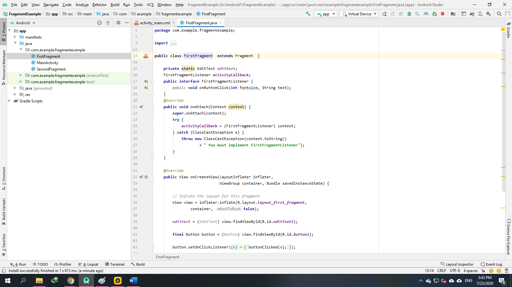
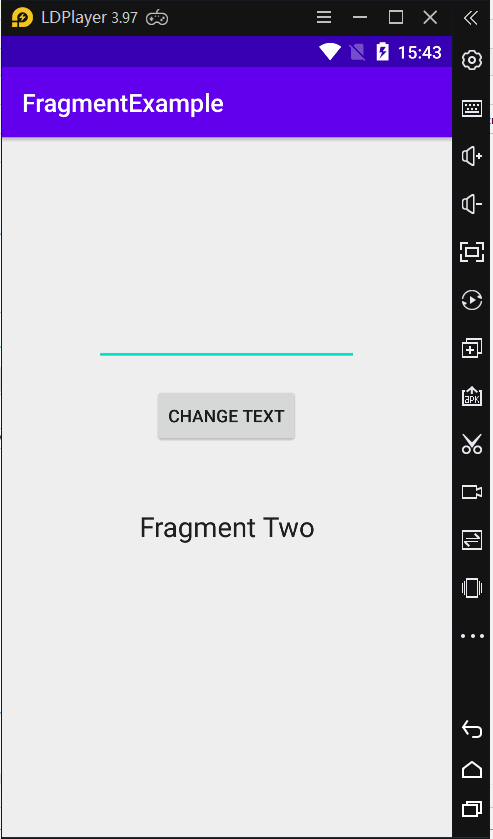
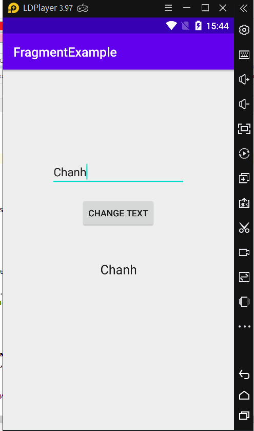

### Fragments trong Android

- <a href= "https://ngocminhtran.com/2018/10/17/fragments-trong-android/"> Ứng Dụng Từ Bài</a>

### Yêu Cầu
A. MÔ TẢ VỀ Android Studio:
### Fragment là gì?
- Fragment trong Android là cơ chế cho phép chúng ta thiết kế các ứng dụng Android theo phương pháp mô-đun – nghĩa là thiết kế giao diện và các tính năng chỉ một lần và sử dụng lại trong các Activity khác nhau.
- Một fragment tương tự một Activity cũng gồm một tập tin layout (.xml) và một tập tin lớp (.java). Có thể hiểu một fragment giống một Activity thu nhỏ.

### Thêm một fragment đến một Activity dùng tập tin XML
- Đầu tiên, các Activities muốn sử dụng các fragment phải kế thừa lớp FragmentActivity thay vì lớp AppCompatActivity (như mặc định), ví dụ:

### Thêm một fragment đến một Activity dùng mã Java
- Cách dễ nhất để thêm fragment đến một Activity là dùng phần tử XML <fragment> nhưng nhược điểm là không thể thay đổi fragment tại thời điểm thực thi (runtime) của ứng dụng. Để có thể kiểm soát fragment trong quá trình thực thi chúng ta có thể thêm fragment dùng mã Java. Đoạn mã sau minh họa cách thêm một fragment đến một Activity dùng Java:

### Xử lý sự kiện fragment
- Một fragment tương tự một Activity tức là nó cũng gồm một layout chứa các views. Khi liên quan đến các views thì vấn đề sự kiện sẽ nảy sinh. Tiếp cận sự kiện và xử lý sự kiện của các views trong một fragment hoàn toàn tương tự các views trong layout của một Activity. Xem lại sự kiện và xử lý sự kiện trong Android.

### Giao tiếp fragments
- Khi các fragments được nhúng vào một Activity thì quá trình giao tiếp sẽ diễn ra giữa các fragments với nhau hay giữa các fragments với Activity. Giữa các fragments không thể diễn ra quá trình giao tiếp trực tiếp mà phải thông qua một Activity trung gian. Một Activity muốn giao tiếp với một fragment thì cần thông qua ID của fragment này; ngược lại, một fragment muốn giao tiếp với Activity thì vần đề trở nên phức tạp hơn. Lúc này phải dùng một giao diện trung gian. Quá trình giao tiếp của fragment sẽ được hiểu rõ hơn quan phần tạo ứng dụng minh họa sau đây.

### Một ứng dụng Android dùng fragment
- Bây giờ chúng ta sẽ tạo một ứng dụng Android chứa một Activity và hai fragments. Fragment thứ nhất sẽ gồm một RelativeLayout chứa một EditText và một Button; fragment thứ hai chỉ chứa một TextView trong một RelativeLayout. Hai fragments được nhúng trong một Activity và khi chúng ta nhập thông tin vào EditText và nhấn Button trong fragment thứ nhất thì nội dung trong EditText sẽ hiển thị trong TextView của fragment thứ hai. Quá trình tạo ứng dụng gồm các bước sau:

- <a href= "https://ngocminhtran.com/tao-du-an-fragmentexample/"> Tạo dự án FragmentExample</a>
- <a href= "https://ngocminhtran.com/tao-fragment-thu-nhat/"> Tạo fragment thứ nhất</a>
- <a href= "https://ngocminhtran.com/tao-fragment-thu-hai/"> Tạo fragment thứ hai</a>
- <a href= "https://ngocminhtran.com/nhung-cac-fragment-den-activity/"> Nhúng các fragment đến Activity</a>
- <a href= "https://ngocminhtran.com/giao-tiep-giua-fragments-va-activity/"> Giao tiếp giữa fragments và Activity</a>
- <a href= "https://ngocminhtran.com/chay-thu-ung-dung/"> Chạy thử ứng dụng</a>

### Chúng Ta tạo thêm 2 cái java

### Sau Khi Thực hiện xong và chạy máy ảo:

### Chạy Xong nhập dữ liệu từ bản TextView
- SecondFragment sẽ hiện ra kết quả bên dưới như Hình

### Kết luận
- Trong bài này chúng ta đã tìm hiểu về fragment – một cơ chế cho phép thực thi theo phương pháp mô-đun trong Android. Có thể tìm hiểu thêm về fragment tại

### Chúc Các Bạn Thành Công !!!

### Bạn Có Thể Xem Bài Tiếp Theo:

- <a href="https://github.com/ChanhMinions/MenuExample">Tạo và quản lý thực đơn tùy chọn (overflow menus) trong Android!</a>

                                                                   Trần Phú , Ngày 23 tháng 7 Năm 2020
